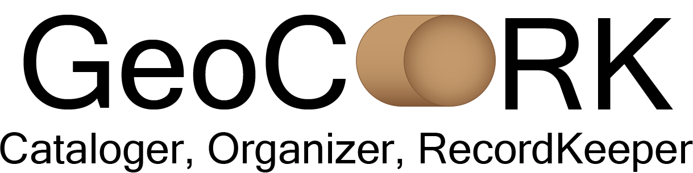

---
<h2 align="center"> An improved workflow for geochronology data management</h2>

## Description
GeoCORK is a desktop application for managing U-Pb geochronology data which are stored in a local relational database. Data can be imported from .xlsx files in various formats and exported for use in analysis tools and data sharing. For more information on using GeoCORK, refer to Metcalf and Burges (in review).

## Download
Find the latest release [here](https://github.com/kathrynmetcalf/GeoCORK/releases).

## Publications
If you have used GeoCORK in your workflow, please cite the accompanying publication and zenodo data release. At the bottom of the page you can find BibTeX formats. 

Metcalf, K., and Burges, J., in review, kathrynmetcalf/GeoCORK: GeoCORK v1.0.5:, doi:10.5281/ZENODO.15833658.

## Example Files
Two example databases and supporting files can be found at (zenodo link).
Klamath_literature.db is a partial compilation of data from the Klamath Mountains with a variety of data formats. 
Puetz_etal_2024.db is a global detrital zircon database with 1.8 million U-Pb analyses. All data are in a uniform format. Other supporting files document changes made to meet the GeoCORK schema requirements.
Explore these databases or start your own.

## Manual
A [basic user guide](https://github.com/kathrynmetcalf/GeoCORK/blob/b916e2b6289c74f5345bacd5859cbddbc8534d16/GeoCORK_UserGuide.docx) is available to help you get started with GeoCORK.
Video tutorials and a user manual are forthcoming.

## Capabilities
### Import
Import data from .xlsx files in various formats or another GeoCORK database file.

### View/Edit
Edit data tables and metadata tags.

### Filter
Create and save complex queries to filter your database. View and edit matching data.

### Export
Export a portion of your database or filtered data sets for data analysis and sharing. Select a defined export format or create your own.

## Data Stored
Data are stored in a .db file. GeoCORK can import from .xlsx files and export to .csv, .xlsx, or .db.

See the [database schema chart](https://github.com/kathrynmetcalf/GeoCORK/blob/master/GeoCORKFullSchema.pdf) for all fields and connections in GeoCORK.

## BibTeX Citation
```
@misc{metcalfKathrynmetcalfGeoCORKGeoCORK2025,
	title = {kathrynmetcalf/{GeoCORK}: {GeoCORK} v1.0.3},
	copyright = {GNU General Public License v3.0 only},
	shorttitle = {kathrynmetcalf/{GeoCORK}},
	url = {https://zenodo.org/doi/10.5281/zenodo.15833658},
	abstract = {Initial release},
	urldate = {2025-10-10},
	publisher = {Zenodo},
	author = {Metcalf, Kathryn and Burges, Jarrod},
	month = jul,
	year = {2025},
	doi = {10.5281/ZENODO.15833658},
}
```

## Contributing
Set up a github account and fork the source code over to get started. If you are interested in contributing to GeoCORK releases, contact [Kate Metcalf](mailto:kametcalf@fullerton.edu).

## License
GeoCORK is licensed under [GNU GENERAL PUBLIC LICENSE Version 3](https://github.com/kathrynmetcalf/GeoCORK/blob/master/LICENSE)
